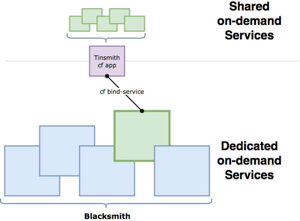

PostgreSQL Tinsmith
===================

A _tinsmith_, in Blacksmith Services parlance, is a Cloud Foundry
Service Broker that runs as a Cloud Foundry Application, consumes
a provisioned, on-demand Blacksmith Service, and makes it
available to the rest of the world as a shared, multi-tenant
service.

A picture may make things clearer:



This Tinsmith, in particular, takes a dedicated PostgreSQL
instance (most likely deployed via the [PostgreSQL Blacksmith
Forge][pg-forge]) and carves up the dedicated host / cluster into
individual databases for each service.  Bound applications will
have free run of their own database, but will be unable to
interact with other shared databases on the same installation.

Deploying
---------

To deploy this Tinsmith, you need the code, a Cloud Foundry, and a
PostgreSQL service from your CF Marketplace.  We heartily
recommend a service deployed via the [Blacksmith][blacksmith] and
its [PostgreSQL Forge][pg-forge], but any service that is tagged
`postgres`, and provides the `host`, `port` (as a number),
`username` and `password` fields in its `$VCAP_SERVICES`
credentials block should do.

```
git clone https://github.com/blacksmith-community/cf-postgres-tinsmith
cd cf-postgres-tinsmith

# push the code...
cf push --no-start
cf bind-service postgres-tinsmith YOUR-DATABASE-SERVICE

# you may want to set some other environment variables at
# this stage; see "Configuration", below.
cf set-env postgres-tinsmith SB_BROKER_USERNAME my-broker
cf set-env postgres-tinsmith SB_BROKER_PASSWORD a-secret

# start the app
cf start postgres-tinsmith

# register this tinsmith as a service broker in CF
cf create-service-broker postgres-tinsmith my-broker a-secret \
  https://postgres-tinsmith.$APP_DOMAIN
cf enable-service-access postgres

# marvel at your handiwork
cf marketplace
```

Configuring
-----------

This tinsmith is configured entirely through environment
variables.

There are environment variables for governing the presentation of
this brokers service / plan in the marketplace:

- `$SERVICE_ID` - The internal ID of the service that this broker
  provides to the marketplace.
- `$SERVICE_NAME` - The CLI-friendly name of the service.
- `$PLAN_ID` - The internal ID of the plan that this broker
  provides to the marketplace.
- `$DESCRIPTION` - A human-friendly description of the service /
  plan, to be displayed in the marketplace
- `$TAGS` - A comma-separated list of tags to apply to instances
  of the service.

There are environment variables for controlling the security and
authentication parameters of the broker:

- `$SB_BROKER_USERNAME` - The HTTP Basic Auth username that must
  be used to access this broker.  Defaults to `b-postgres`.
- `$SB_BROKER_PASSWORD` - The HTTP Basic Auth password that must
  be used to access this broker.  Defaults to `postgres`.

You can also override the service selection logic and force it to
pick a specific, named service by setting the `$USE_SERVICE`
environment variable to its name.  Otherwise, the broker will look
for bound services that are tagged `postgres` or `postgresql`.


[pg-forge]: https://github.com/blacksmith-community/postgresql-forge-boshrelease
[blacksmith]: https://github.com/cloudfoundry-community/blacksmith
